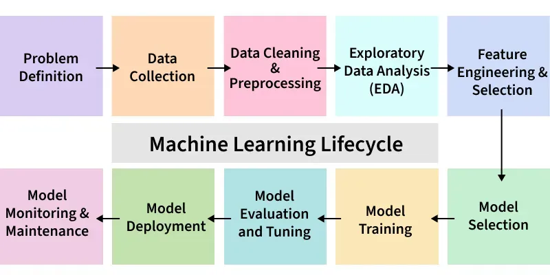

## Machine Learning Lifecycle

Machine Learning Lifecycle is a structured process for developing, deploying, and maintaining ML models, ensuring accuracy, reliability, and scalability.

By following this lifecycle, we can:

- Define objectives, scope, and success criteria for clear project direction.
- Collect diverse, sufficient datasets from reliable sources.
- Clean and preprocess data, handling issues like missing values and outliers.
- Analyze data using statistics and visualizations to uncover insights.
- Engineer features and select relevant attributes for better model performance.
- Train models, compare options, and select the best one.
- Evaluate on unseen data, optimize, and measure performance.
- Deploy models into production and monitor for drift, retraining as needed.

### Data Processing

#### Data Cleaning
- Raw Data: Initial data collected from various sources. Log files, Audio/Video files, Images, Text files, etc., Transactional data, etc.)
- Goal: Make that raw data accurate, consistent, free of errors, and usable for analysis.

##### How to Clean Data
1. Remove duplicates
2. Remove unwanted observations
3. Handle missing values
4. Manage outliers