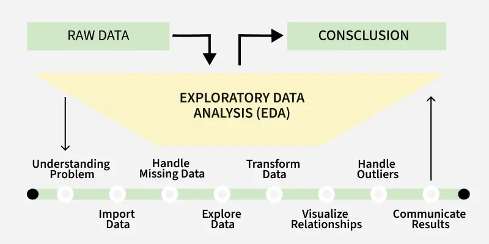
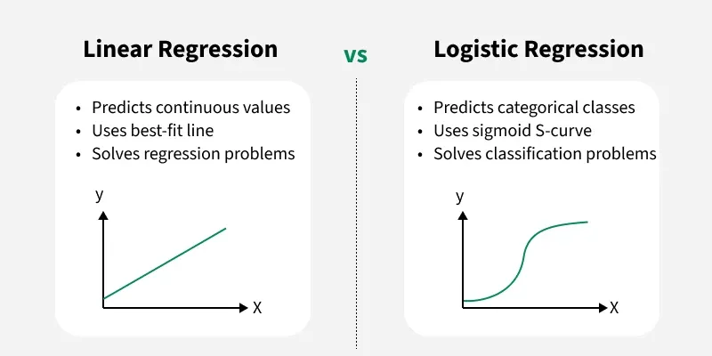
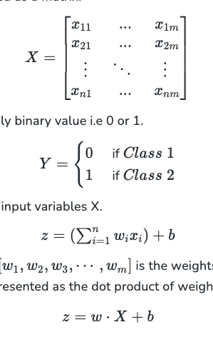
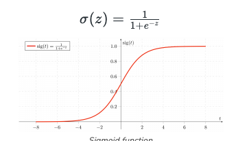
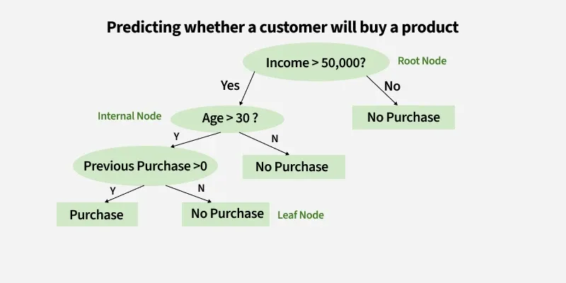

## EDA (Exploratory Data Analysis)

1. Univariate Analysis
   - Analyzing each feature individually to understand its distribution and characteristics.
   - Techniques include histograms, box plots, and frequency tables.
2. Bivariate Analysis
    - Examining the relationship between two features.
   - Techniques include scatter plots, correlation coefficients, and cross-tabulations.
3. Multivariate Analysis
    - Analyzing more than two features simultaneously to understand complex relationships.
   - Techniques include pair plots, 3D scatter plots, and dimensionality reduction techniques like PCA.

## Model Evaluation (Skipping for now)

## Models
Typed of Machine Learning:
1. Supervised Learning
   - The model is trained on labeled data, meaning that each training example is paired with an output label.
   - Examples: Linear Regression, Decision Trees, Support Vector Machines, Neural Networks.
2. Unsupervised Learning
   - The model is trained on unlabeled data and must find patterns and relationships in the data on its own.
   - Examples: K-Means Clustering, Hierarchical Clustering, Principal Component Analysis (PCA).
2.1. Semi-Supervised Learning / Self-Supervised Learning
   - The model is trained on a small amount of labeled data and a large amount of unlabeled data.
   - Examples: Semi-Supervised SVM, Graph-Based Methods.
3. Reinforcement Learning
   - The model learns by interacting with an environment and receiving feedback in the form of rewards or penalties.
   - Examples: Q-Learning, Deep Q-Networks (DQN), Proximal Policy Optimization (PPO).
  
## Supervised Learning Algorithms
1. Classification Algorithms
   - Logistic Regression
   - Decision Trees
   - Random Forest
   - Support Vector Machines (SVM)
   - K-Nearest Neighbors (KNN)
   - Neural Networks
2. Regression Algorithms
   - Linear Regression
   - Ridge Regression

### Linear Regression -  Check the Notebook for implementation
### Logistic Regression

## Decision Trees

